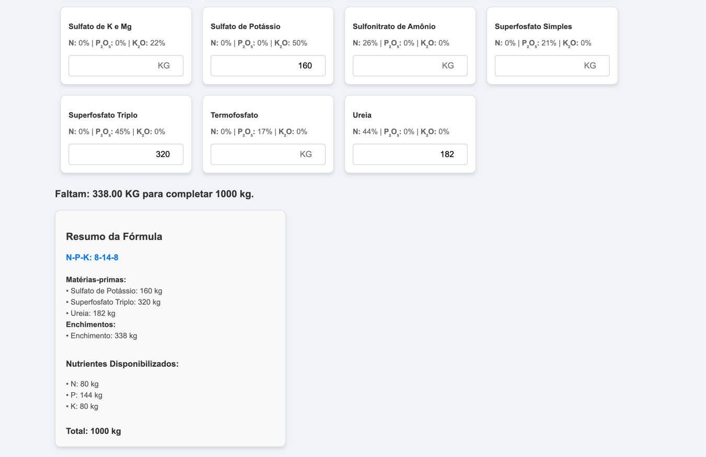
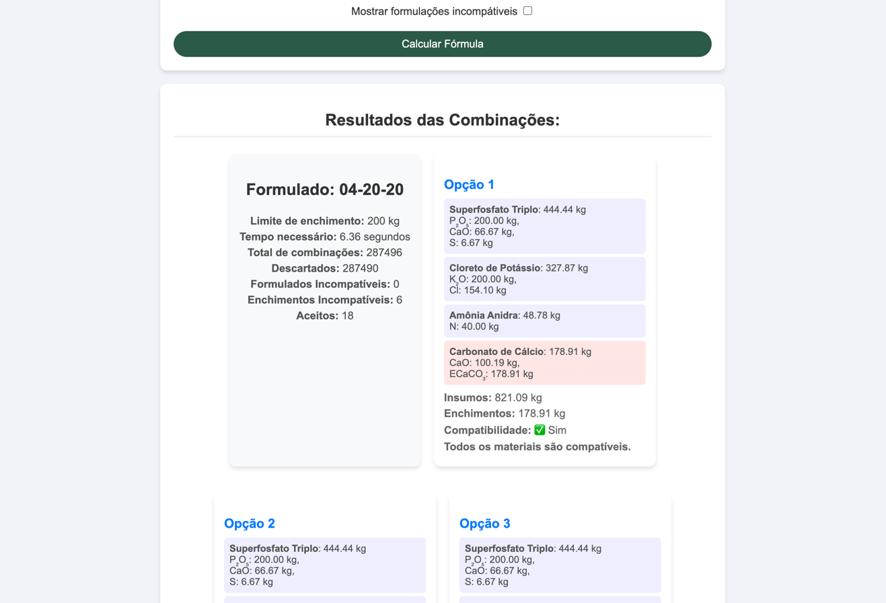

# Formulador de Fertilizantes

Esta aplicação é uma ferramenta completa para auxiliar na criação e gestão de formulações de fertilizantes, composta por três módulos principais:

1. **Cadastro de Nutrientes**  
   Permite o gerenciamento dos nutrientes e insumos disponíveis. Neste módulo você pode cadastrar, editar e remover nutrientes e matérias-primas, garantindo que os dados usados nos cálculos estejam sempre atualizados.

2. **Formulador 1 – Cálculo Manual do Formulado**  
   Neste módulo o usuário insere manualmente a quantidade (em kg) de cada matéria-prima disponível para montar uma fórmula. É ideal para quem deseja ter controle total sobre as quantidades inseridas e realizar ajustes manuais conforme necessário.

3. **Formulador 2 – Geração Automática de Formulados**  
   A partir do formulado desejado (no formato N-P-K) e dos insumos selecionados, este módulo gera automaticamente todas as combinações possíveis. O sistema calcula as quantidades necessárias de cada matéria-prima para atingir os teores desejados, ajusta a formulação com enchimentos se necessário e valida a compatibilidade entre os insumos com base em restrições definidas.


---

## Recursos

- **Cadastro de Nutrientes:**  
  - Gerenciamento de insumos e nutrientes.
  - Interface para adicionar, editar e remover matérias-primas e seus teores.

- **Formulador 1 – Cálculo Manual:**  
  - Entrada manual das quantidades (em kg) dos insumos.
  - Cálculo direto do formulado com base nos insumos informados.
  - Ideal para ajustes e controle preciso dos insumos.

- **Formulador 2 – Geração Automática:**  
  - Geração de combinações automáticas de matérias-primas de acordo com o formulado desejado.
  - Cálculo dos kg necessários de cada insumo para atender aos teores de N, P e K.
  - Validação de compatibilidade dos insumos com base em regras definidas em um arquivo JSON de restrições.
  - Ajuste com enchimentos para completar o total desejado (por exemplo, 1000 kg).

- **Validação de Compatibilidade:**  
  - Verifica as restrições entre insumos com base em um arquivo JSON atualizado.
  - Permite identificar incompatibilidades e limitações na mistura.

- **Interface Web Dinâmica:**  
  - Desenvolvida com FastHTML, a interface apresenta formulários, tabelas e cartões de resultados, facilitando a interação do usuário com o sistema.

---

## Requisitos

- Python 3.7+
- FastHTML (ou framework similar para renderização de HTML)
- Bibliotecas Python listadas em `requirements.txt` (ex.: numpy, scipy, etc.)

---

## Instalação

1. **Clone o repositório:**

   ```bash
   git clone https://seurepositorio.com/formulador.git
   cd formulador
   
2. **Instale as dependências:**

   ```bash
   pip install -r requirements.txt

---

## Estrutura do Projeto
    formulador/
    ├── components/
    │   ├── test1.py                # Testes e execução do Formulador 1 (Cálculo Manual)
    │   └── test2.py                # Testes e execução do Formulador 2 (Geração Automática)
    ├── logica/
    │   ├── logica_formulacao_2.py  # Lógica principal para a geração de combinações e cálculo de fornecimento (Formulador 2)
    │   └── validacao_compatibilidade.py  # Funções para validação de compatibilidade entre insumos
    ├── static/
    │   ├── restricoes_compatibilidade.json  # Lista de restrições de compatibilidade
    │   ├── style.css               # Arquivo de estilos CSS
    │   └── script.js               # Script JavaScript para a interface
    ├── formulador.py               # Arquivo de roteamento e integração com FastHTML (Módulo Geral)
    ├── cadastro_nutrientes.py      # Roteamento e interface do módulo de Cadastro de Nutrientes
    ├── formulador1.py              # Roteamento e interface do Formulador 1 (Cálculo Manual)
    ├── formulador2.py              # Roteamento e interface do Formulador 2 (Geração Automática)
    └── README.md                   # Este arquivo

---
## Uso
### Iniciando a Aplicação

**Para iniciar o servidor da aplicação, execute:**
    
    python formulador.py

**Em seguida, acesse as seguintes rotas no seu navegador:**
- Cadastro de Nutrientes: http://localhost:5000/cadastro_nutrientes
- Formulador 1 - Cálculo Manual: http://localhost:5000/formulador1
- Formulador 2 - Geração Automática: http://localhost:5000/formulador2

**Formulador 1 – Cálculo Manual**
No Formulador 1, o usuário:

- Insere manualmente a quantidade (em kg) de cada matéria-prima disponível.
- Realiza o cálculo do formulado com base nos insumos informados.
- Ajusta a formulação conforme necessário.


---

**Formulador 2 – Geração Automática**
No Formulador 2, o usuário:

- Informa o formulado desejado (no formato `N-P-K`, por exemplo, `04-20-20).
- Seleciona os insumos disponíveis na tabela interativa.
- Clica no botão "Calcular Fórmula" para gerar automaticamente as combinações, calcular as quantidades necessárias de cada insumo e validar as compatibilidades.
- Visualiza os resultados em cartões que mostram os insumos, os kg calculados, as contribuições dos nutrientes e os ajustes de enchimento, se aplicável.



---
## Contato
Para dúvidas ou sugestões, entre em contato via email `wesleybento.agro@gmail.com` ou através do GitHub.

